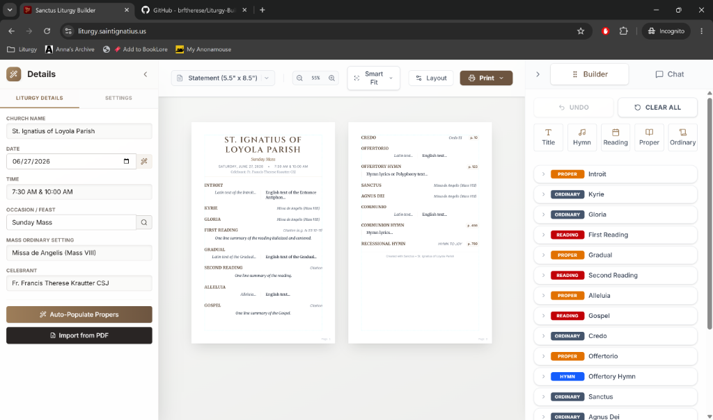

<div align="center">

</div>

# Sanctus Liturgy Builder

> **Live Application:** [https://liturgy.saintignatius.us](https://liturgy.saintignatius.us)

A web-based tool designed to help church musicians and directors quickly auto-generate, edit, and layout Roman Catholic Liturgical propers and documents using the power of Google's Gemini AI.

## 🌟 Key Features

1. **AI Auto-Population**
   - Automatically fetch the liturgical propers (Introit, Gradual, Alleluia, Offertory, Communion) for any Roman Catholic feast day or Sunday.
   - Built-in liturgical calendar lookup. Also search for "Christmas" or "3rd Sunday of Advent" and Gemini will resolve the correct text and date.
   
2. **PDF Parsing & Enrichment**
   - Import existing liturgy PDFs. The tool will parse the text and use AI to automatically clean it up and slot the hymns, motets, and propers into their correct categories with translations if needed.

3. **Live Print-Preview & Editor**
   - A real-time split-screen editor. Modify the text, switch Mass Settings, change fonts, and adjust layout spacing.
   - The Print Preview panel accurately displays what the final printed PDF will look like.
   - Click "Print" to automatically format the document into a clean, 2-column layout perfect for choirs and congregants.

4. **Private API Key Support**
   - A built-in proxy architecture allows the server to securely communicate with the Gemini API. Users can also provide their own API key in the UI settings to bypass the server's rate limits.

---

## 🛠️ Tech Stack

- **Frontend:** React, TypeScript, Vite, Tailwind CSS v4, Lucide React Icons
- **Backend:** Node.js, Express (used as a secure proxy for API keys and CORS)
- **AI Integration:** `@google/genai` (Gemini SDK)
- **Deployment:** PM2, Cloudflare

---

## 🚀 Run Locally

**Prerequisites:** Node.js (v18+)

1. **Install dependencies:**
   ```bash
   npm install
   ```

2. **Configure API Keys:**
   Copy the example environment file and add your Gemini API key:
   ```bash
   cp .env.example .env.local
   ```
   Open `.env.local` and set your key:
   ```env
   GEMINI_API_KEY=your_key_here
   ```

3. **Build the frontend:**
   ```bash
   npm run build
   ```

4. **Start the backend server:**
   ```bash
   npm start
   ```
   *(Alternatively, run `node server.js` directly)*

5. **Open in browser:**
   Navigate to `http://localhost:3000` (or whatever port the server prints).
